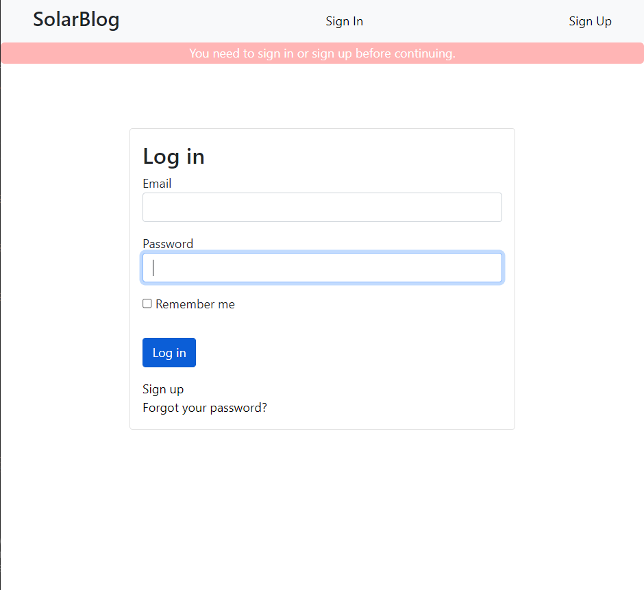
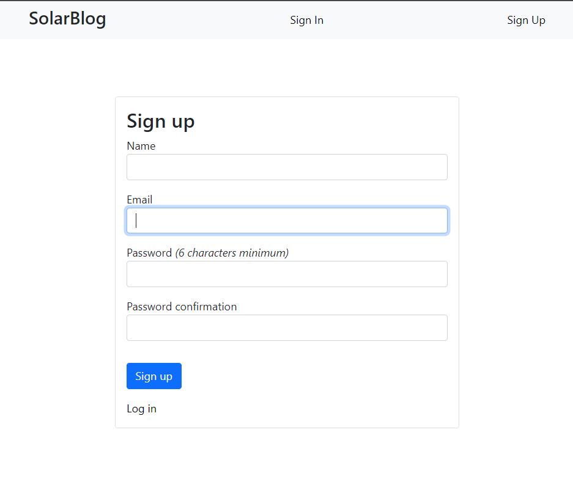
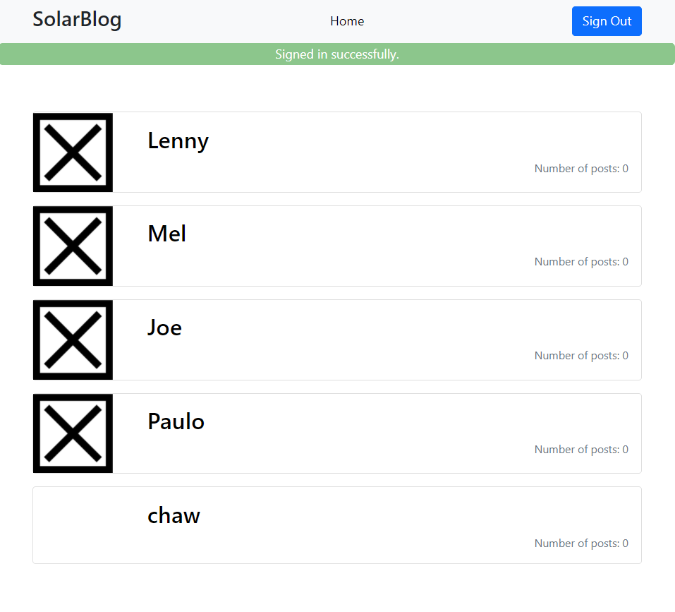
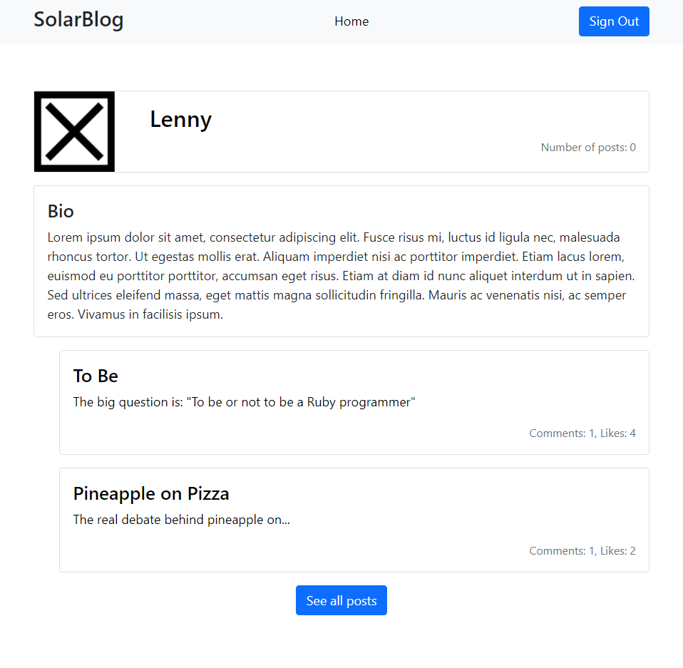
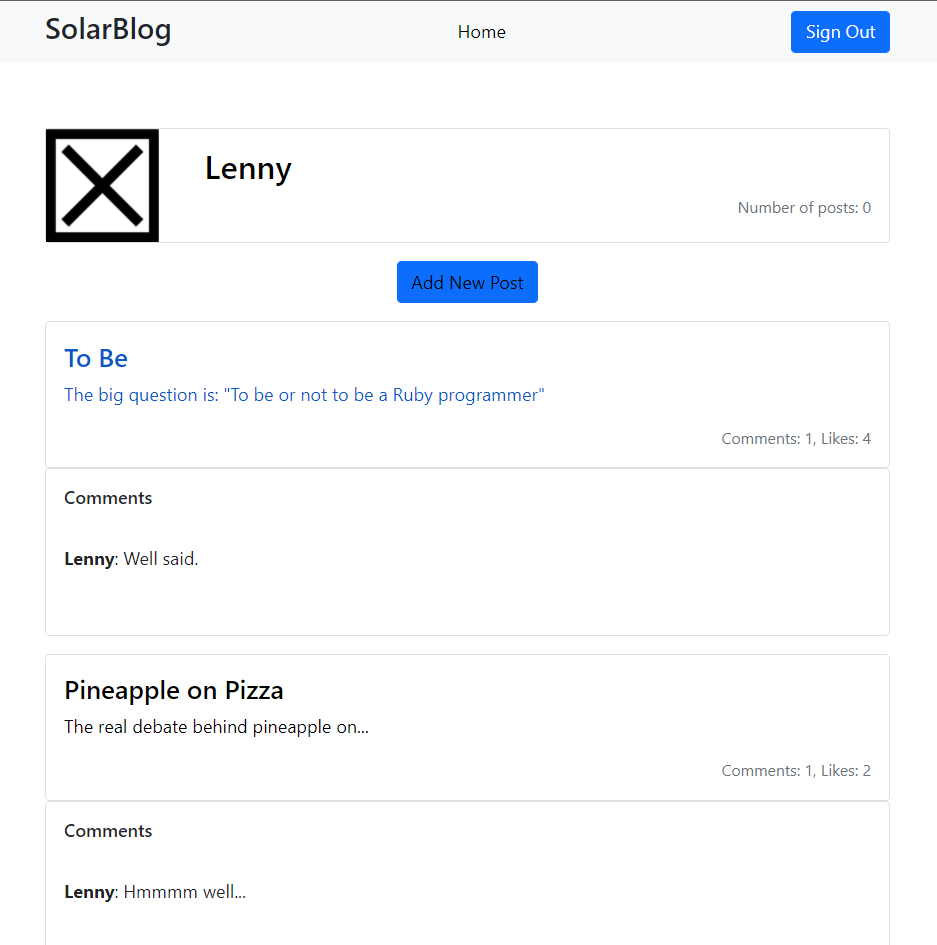
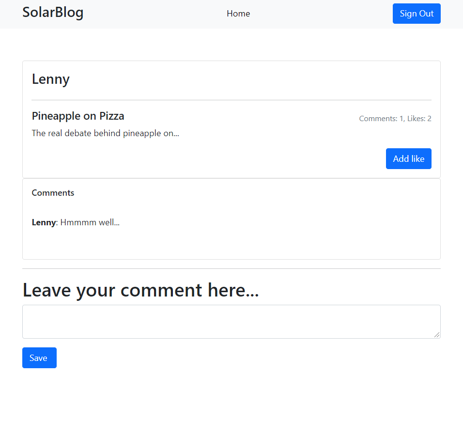

# The Solar Blog App

The Blog app is a blog website. It's a fully functional website that will show the list of posts and empower readers to interact with them by adding comments and liking posts.

<!-- ## Screenshots

> |Screenshot 1|Screenshots 2|
> |--------------|----------------|
> |||!
> |Screenshot 3|Screenshots 4|
> |--------------|----------------|
> |||!
> |Screenshot 5|Screenshots 6|
> |--------------|----------------|
> |||! -->

## Built With
- Ruby
- Ruby on Rails
- RSpec
  
## Setup
- Get the link of the repository: [https://github.com/chaw-bot/SolarBlog](https://github.com/chaw-bot/SolarBlog)
- Clone it as `git@github.com:chaw-bot/SolarBlog.git` on a Terminal
- Usage
- Run bundle install on a Terminal to get Gemfile dependencies.
- Start the server by running `rails s`
  
## Author

👤 **Chawanzi Ng'uni**

- GitHub: [@chaw-bot](https://github.com/chaw-bot)
- Twitter: [@chaw36422087](https://twitter.com/chaw36422087)
- LinkedIn: [Chawanzi Ng'uni](https://www.linkedin.com/in/chawanzi-ng-uni-449328212/)

## 🤝 Contributing

Contributions, issues, and feature requests are welcome!

Feel free to check the [issues page](https://github.com/chaw-bot/OOP-School-Library/issues).

## Show your support

Give a ⭐️ if you like this project!

## Acknowledgments
- Microverse
- Ruby documentation
- Stack Overflow